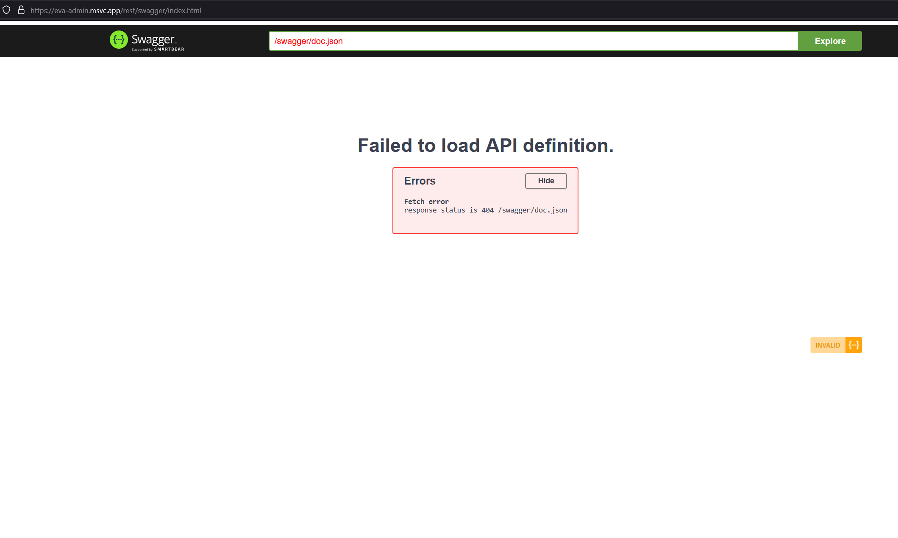
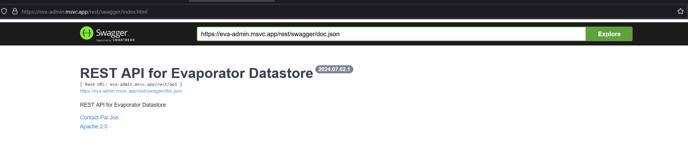

# Penjelasan Penggunaan Endpoint

Akses Swagger-UI di [sini](https://eva-admin.msvc.app/rest/swagger/index.html) untuk mencoba endpoint-endpoint yang ada.

Nanti akan muncul error seperti pada gambar berikut:


Untuk itu, masukkan `https://eva-admin.msvc.app/rest/swagger/doc.json` pada kolom isian `Explore` di bagian atas halaman. Nanti akan menjadi seperti gambar ini:


Kemudian klik `Explore` dan akan muncul daftar endpoint yang bisa digunakan.
Silakan bisa mulai mencoba endpoint-endpoint yang ada.

## Ping
### GET `/api/ping`
ini digunakan untuk mengecek apakah server berjalan atau tidak

## Evaporator
Endpoint-endpoint yang berhubungan dengan data sensor Evaporator
### POST `/api/eva-data`
digunakan untuk menambahkan data sensor baru. Request body berupa JSON dengan format:
```json
{
  "thermal": 0,
  "notes": "string",
  "trial_code": "string"
}
```
- `thermal` merupakan data suhu bayi.
- `notes` merupakan catatan tambahan jika diperlukan.
- `trial_code` merupakan kode uji coba.

Untuk `trial_code` ini, harus sama dengan nanti yang ada di inputan pada endpoint `/api/eva-cv` karena inilah yang akan menghubungkan data sensor dengan data video/citra.

### POST `/api/eva-cv`
digunakan untuk menambahkan data citra/video dari evaporator. Perhatikan bahwa khusus untuk endpoint ini, request body berupa `form-data` (`Content-Type` header harusnya berupa `multipart/form-data`). Ada 3 field yang harus diisi:
- `trial_code` merupakan kode uji coba.
- `file` merupakan file citra/video.
- `data_type` merupakan tipe file yang diupload. Ada 2 tipe file yang bisa diupload, yaitu `image` dan `video`.

Untuk `trial_code`, harus sama dengan kode uji coba yang ada di inputan pada endpoint `/api/eva-data`. Untuk `notes` bisa diisi dengan catatan tambahan jika diperlukan.